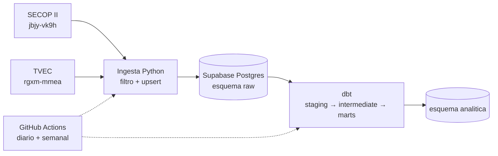

# Gasto del Estado colombiano en nube y licencias

> **English summary.** End-to-end data pipeline that measures how much Colombian public entities spend on cloud services and software licenses from Microsoft, Oracle, AWS and Google. It pulls contracts from SECOP II and the Colombian government marketplace (TVEC) through the Socrata API, loads them into PostgreSQL (Supabase), and transforms them with dbt. The hard part: most contracts are signed with resellers, not with the vendor, so the vendor is inferred from the contract text using rules stored as dbt seeds and evaluated against a hand-labeled sample. Runs daily on GitHub Actions at zero cost.

¿Qué entidades del Estado gastan más en AWS, Microsoft, Oracle y Google? Los datos son públicos, pero no se pueden consultar así directamente: casi nunca se le contrata al fabricante, sino a un revendedor. En el SECOP aparece el nombre del distribuidor, no el de Microsoft u Oracle. Por eso el fabricante hay que sacarlo del texto del objeto del contrato.

Este repositorio es el pipeline completo, desde la API pública hasta tablas listas para analizar, y se actualiza solo todos los días.

## Arquitectura



| Capa | Herramienta | Qué hace |
|---|---|---|
| Fuentes | API SODA de datos.gov.co | SECOP II Contratos Electrónicos y Tienda Virtual del Estado Colombiano, desde 2020 |
| Ingesta | Python (`requests`, `psycopg`) | Consulta mes a mes, filtra en origen, reintenta errores 429/5xx, hace upsert y registra cada carga |
| Almacenamiento | PostgreSQL 17 en Supabase (plan gratuito) | Esquema `raw` con todo en texto, tal como llega |
| Transformación | dbt 1.12 | Limpieza, unión de fuentes, clasificación por reglas, marts y pruebas |
| Orquestación | GitHub Actions | De lunes a sábado recarga los dos últimos meses; los domingos, todo desde 2020 |

Costo: $0. El límite que más pesa es el de 500 MB de Supabase, y por eso se filtra al consultar la API y no después. La base completa ocupa unos 85 MB.

## Decisiones de diseño

**Filtrar en la ingesta.** No cabe todo SECOP II en 500 MB, así que solo se traen los contratos cuyo objeto menciona a un fabricante (MICROSOFT, AZURE, ORACLE, AWS, GOOGLE…) o palabras como NUBE, CLOUD y SOFTWARE. LICENCIA y SUSCRIPCIÓN solo cuentan si el código UNSPSC es de tecnología, porque esas palabras solas traen mucho ruido que no tiene nada que ver con tecnología. Las palabras se eligieron después de medir cuántos contratos traía cada una (`docs/medicion_palabras.txt`).

**Carga verificable.** Cada mes se carga por separado. Se cuenta cuántos registros dice la API que hay, cuántos se leyeron y cuántos ids únicos llegaron, y si no coinciden la carga queda marcada como `incompleta` en `raw.cargas` y el workflow falla. El upsert permite repetir cualquier mes sin duplicar.

**Reglas en datos, no en código.** La clasificación vive en tres seeds de dbt:

- `terminos_fabricante.csv`: patrones de texto → fabricante.
- `proveedores_fabricante.csv`: proveedores que son el propio fabricante, como Oracle Colombia o Branch of Microsoft.
- `reglas_tipo_gasto.csv`: patrones → `nube`, `licencia`, `soporte_fabricante` o `fuera_de_alcance`, con prioridad.

Cambiar una regla es editar un CSV y correr `dbt build`. Las reglas usan límites de palabra (`\mAWS\M`) para que "AWS" no aparezca dentro de otra palabra.

**No prorratear.** Si un contrato menciona a dos fabricantes, queda como `multi_fabricante` con su valor completo. Inventar un reparto sería peor que reconocer que no se puede separar.

**Marcar, no borrar.** Los contratos cancelados o en borrador no suman al gasto, pero siguen en la base. Con eso se arma `mart_cancelaciones`, porque la tasa de cancelación también es un dato interesante.

Todas las reglas, con su justificación, están en [`docs/reglas_negocio.md`](docs/reglas_negocio.md).

## Modelos dbt

```
staging/        stg_secop_contratos, stg_tvec_ordenes      limpieza y tipos
intermediate/   int_registros                              las dos fuentes con columnas comunes
                int_clasificacion                          fabricante y tipo de gasto
calidad/        evaluacion_muestra                         reglas vs. etiquetas manuales
marts/          fct_gasto_tic                              una fila por contrato u orden en alcance
                mart_gasto_entidad_fabricante              entidad × fabricante × año
                mart_cancelaciones                         tasa de cancelación por entidad
```

Pruebas: unicidad y no nulos en los ids de cada fuente, fecha obligatoria, y una prueba de advertencia para valores mayores a un billón de pesos. Esa última existe porque en SECOP II hay un contrato registrado por unos 620 billones, lo que muestra que la fuente tiene errores de digitación.

## Calidad de la clasificación

Se etiquetaron a mano 60 registros (los 30 de mayor valor y 30 al azar) y se compararon con lo que asignan las reglas:

| Medida | Acierto |
|---|---|
| Tipo de gasto | 78 % |
| Fabricante, en registros dentro del alcance | 96 % |

La primera versión daba 72 % en tipo de gasto. Al revisar los errores apareció que "UNIFIED" no solo nombra el soporte de Microsoft, sino también licencias M365. Al corregir esa regla, el acierto subió a 78 %.

Una aclaración honesta: la muestra la etiquetó la misma persona que escribió las reglas, así que la medición no es del todo independiente.

## Primeros resultados

Corte de octubre de 2026, con 21.614 contratos y órdenes de nube y licencias:

| Fabricante | Registros | Valor (billones COP) |
|---|---|---|
| Otros / no identificado | 17.487 | 7,19 |
| Microsoft | 3.092 | 3,03 |
| Oracle | 346 | 0,24 |
| Google | 587 | 0,19 |
| Varios fabricantes | 51 | 0,04 |
| AWS | 51 | 0,02 |

Microsoft domina: aparece en 14 de las 15 combinaciones entidad × fabricante de mayor valor. La mayor es el Consejo Superior de la Judicatura, con unos 356 mil millones.

Cuidado al leer la tabla. "Otros" pesa 67 % del valor, y ahí hay gasto real de nube que el contrato no atribuye a ningún fabricante. El bajo valor de AWS puede ser real o puede ser efecto de esto; todavía no está verificado.

## Limitaciones

- No incluye SECOP I, así que se pierden entidades que siguieron publicando allí.
- El valor es el comprometido en el contrato; las adiciones no se suman.
- Las entidades aparecen con el nombre que publica la fuente, por dependencia. La Rama Judicial, por ejemplo, sale separada en Consejo Superior y Dirección Ejecutiva.
- Las licencias cuyo texto no usa palabras de licenciamiento quedan sin clasificar.
- Falta verificar si un mismo gasto aparece a la vez en TVEC y en SECOP II.

## Cómo correrlo

Requisitos: Python 3.14 y un proyecto de Supabase (o cualquier Postgres).

```bash
python -m venv .venv
source .venv/bin/activate
pip install -r requirements.txt

cp .env.example .env          # llenar PGHOST, PGPORT, PGUSER, PGPASSWORD, PGDATABASE
set -a; source .env; set +a
```

Crear las tablas `raw`, ejecutando `sql/001_raw.sql` en el editor SQL de Supabase o con:

```bash
psql -f sql/001_raw.sql
```

Cargar un periodo (meses en formato `AAAA-MM`) y transformar:

```bash
python ingesta/secop.py 2020-01 2026-10
python ingesta/tvec.py 2020-01 2026-10

cd transformacion
dbt build --profiles-dir .
```

La carga completa desde 2020 tarda unos 18 minutos.

Para automatizarlo con GitHub Actions, se cargan las mismas cinco variables `PG*` como secrets del repositorio. El workflow está en `.github/workflows/pipeline.yml` y también se puede lanzar a mano, eligiendo `ventana` (últimos dos meses) o `completa`.

## Estructura

```
ingesta/         api.py, carga.py, reglas.py, secop.py, tvec.py, db.py
sql/             001_raw.sql
transformacion/  proyecto dbt (models, seeds, macros, tests)
calidad/         generación de la muestra para etiquetar
docs/            reglas de negocio y resultados de la exploración inicial
.github/         workflow de GitHub Actions
```

## Fuentes

- [SECOP II – Contratos Electrónicos](https://www.datos.gov.co/d/jbjy-vk9h)
- [Tienda Virtual del Estado Colombiano](https://www.datos.gov.co/d/rgxm-mmea)

Datos abiertos publicados por Colombia Compra Eficiente en datos.gov.co.
